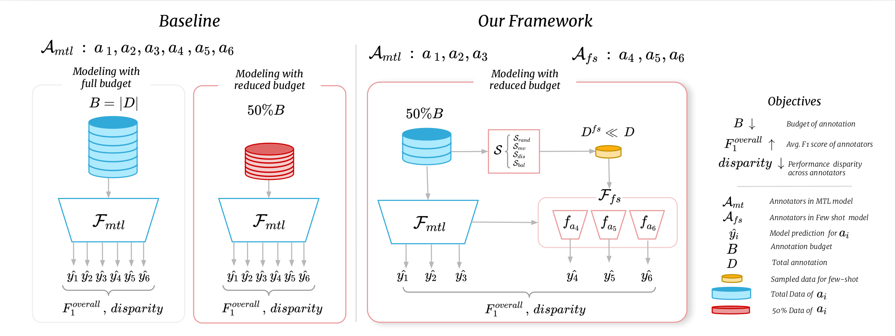

# Cost-Efficient Subjective Task Annotation and Modeling through Few-Shot Annotator Adaptation

This repository contains the code implementation corresponding our paper named "Cost-Efficient Subjective Task Annotation and Modeling through Few-Shot Annotator Adaptation
"

## Overview




The provided codebase supports the experiments and methodologies discussed in the paper. The repository includes scripts for multitask learning, few-shot learning, and testing models.

## Prerequisites

Make sure you have the necessary dependencies installed. You can install them using the provided requirements file:

```bash
pip install -r requirements.txt
```

## Data

### Brexit Dataset

To use the Brexit dataset, follow these steps:

1. Download the dataset from the provided link: [Brexit Dataset](https://le-wi-di.github.io/)
2. Prepare the dataset using the Jupyter notebooks:
   - `notebooks/hs_prepare_data.ipynb`, `notebooks/create_mtl_mvs_data.ipynb`: These notebook contain the code for data preparation specific to the Brexit dataset.

### Moral Foundations Subjective (Reddit) Corpus

For the MFSC dataset, we have included it with the code in the `data/mfrc` directory. No additional download is necessary. Simply use the provided dataset in your experiments.


## Running MTL models
To run MTL models you can use `mtl_main.py` script with the following parameters:

- `--dataset`: Specify the dataset for training and evaluation (e.g., "mfrc").
- `--label`: Specify the target label for the multitask learning (e.g., "Moral").
- `--train_batch_size`: Set the training batch size (e.g., 64).
- `--budget`: Set the budget for the multitask learning (e.g., 0.25).
- `--mtl_tasks`: Define the multitask learning tasks (the comma seperated annotators to use in mtl training).
- `--run_sweep`: to do hyperparameter tuning for the model.
- `--seed`: Set the random seed for reproducibility (replace `$seed` with an integer).

### Example Command

```bash
python mtl_main.py --dataset "mfrc" --label "Moral" --train_batch_size 64 --budget 0.25 --mtl_tasks "$tasks_1" --run_sweep --seed $seed
```


Specically, for training and testing the baseline models use the following scripts : (make sure to set the avaialbe GPUs accordingly in the scripts before running.)

```bash
cd scripts
./run_brexit_baselines_mtl.sh
./run_mfrc_baselines_mtl.sh
```

For running our framework's first stage multitask models:

```bash
cd scripts
./run_brexit_3mtl.sh
./run_brexit_4mtl.sh
./run_brexit_5mtl.sh

./run_mfrc_6mtl.sh
./run_mfrc_12mtl.sh
./run_mfrc_18mtl.sh
```
## Testing Usage

Run the `mtl_test_model.py` script with the following parameters:

- `--dataset`: Specify the dataset for training and evaluation (e.g., "mfrc").
- `--label`: Specify the target label for the multitask learning (e.g., "Moral").
- `--seed`: Set the random seed for reproducibility (replace `$seed` with an integer).
- `--split`: Specify the dataset split for testing (e.g., "test").
- `--budget`: Set the budget for testing (replace `$b` with the desired budget).

### Example Command

```bash
python mtl_test_model.py  --dataset "mfrc" --label "Moral" --seed $seed --split "test" --budget $b
```


after running the scripts and having the models, you can test them on test sets with the following scripts:

```bash
cd scripts
./test_brexit_mtl_models.sh
./test_mfrc_mtl_models.sh
```


## Running fews shot models


Run the `fewshot_main.py` script with the following parameters:

- `--dataset`: Specify the dataset for few-shot learning (use quotes, e.g., "brexit").
- `--label`: Specify the target label for few-shot learning (use quotes, e.g., "Hate").
- `--few_shot_task`: Specify the few-shot learning task (use quotes, e.g., "Ann1").
- `--n_mtl_tasks`: Specify the number of multitask learning tasks  (replace `$n_mtl` with an integer).
- `--seed`: Set the random seed for reproducibility (replace `$seed` with an integer).
- `--balance_ratio`: Set the balance ratio (e.g., 0).
- `--epochs`: Set the number of training epochs (e.g., 30).
- `--k_shot`: Set the number of shots for few-shot learning.
- `--few_shot_sample_strategy`: Specify the few-shot sample strategy (use quotes, e.g., "balanced").


### Example Command

```bash
python fewshot_main.py --dataset "brexit" --label "Hate" --few_shot_task "Ann1" --n_mtl_tasks 3 --seed 0 --balance_ratio 0 --epochs 30 --k_shot 16 --few_shot_sample_strategy "balanced"

```

To generate the fewshot models and test results you can run the following scripts:


```bash
cd scripts
./run_brexit_fewshot.sh
./run_mfrc_fewshot.sh
```


## Generating Tables and Results

To generate the tables and figure in the paper from the reuslts please use the following Jupyter notebooks available in this repository:

1. **Table 1**: `notebooks/overall_model_performance.ipynb`

2. **Table 2**: `notebooks/fs_sampling_comparision_table.ipynb`

3. **Table 3**: `notebooks/annotators_f1_variance.ipynb`

4. **Figure 2**: `notebooks/mtl_vs_n_mtl.ipynb`

5. **Figure 3**: `notebooks/annotator_level_performance.ipynb`

Make sure to run the cells in these notebooks in sequence to obtain the desired tables and results. Adjust any necessary parameters or configurations within the notebooks to match your specific requirements.

